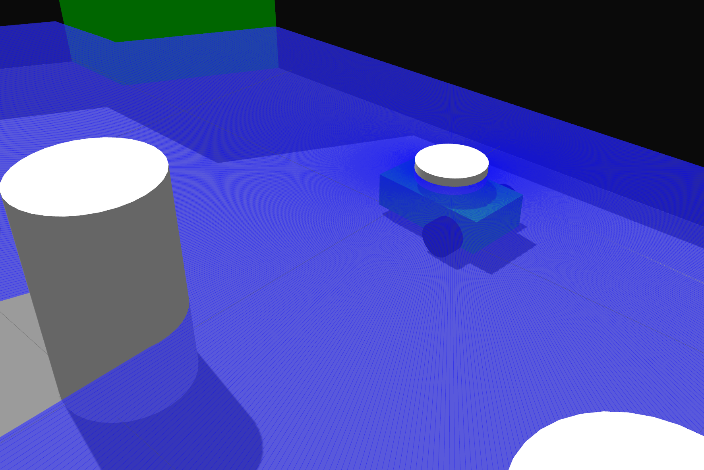
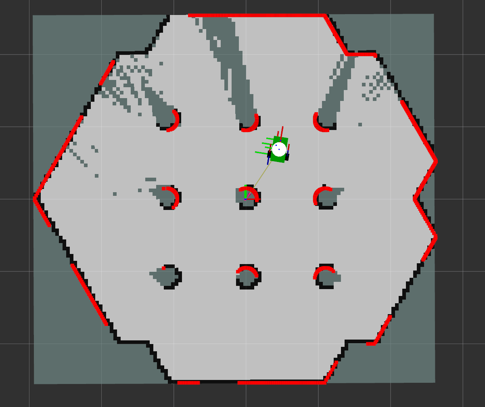

# 🚀 nav2_mr_sim

A minimal ROS 2 simulation package for differential drive robots integrated with Navigation2 (Nav2) and Gazebo.

**Maintainer**: Huynn  
Email: huy.nguyenngoc2137@gmail.com  

---

## 📦 Features
- Simulation:
  - Robot: Differential drive mobile robot
  - World: Refered Turtlebot 3 world
- Mapping: Graph-based SLAM of SlamToolbox package
- Localization: AMCL



---

## 🚀 Quick Start

### 1. Clone the repository

```bash
mkdir -p <your workspace path>/src
cd <your workspace path>/src
git clone ...
```

### 2. Installation

#### 2.1 Dependencies
```bash
cd <path to nav2_mr_sim>
rosdep install --from-paths src --ignore-src -r -y
sudo apt install \
  ros-foxy-controller-manager \
  ros-foxy-controller-manager-msgs \
  ros-foxy-control-msgs \
  ros-foxy-hardware-interface \
  ros-foxy-diff-drive-controller

colcon build
```


### 4. Run

#### 4.1 Mapping
```bash
cd <path to nav2_mr_sim>
source init_setup.sh .  # please run the following sh file to setup environment variables
ros2 launch nav2_mr_sim 1_gazebo.launch.py
ros2 launch nav2_mr_sim 2_slam.launch.py
```




#### 4.2 Navigation
```bash
cd <path to nav2_mr_sim>
source init_setup.sh .  # please run the following sh file to setup environment variables
ros2 launch nav2_mr_sim 1_gazebo.launch.py
ros2 launch nav2_mr_sim 3_nav.launch.py
```

